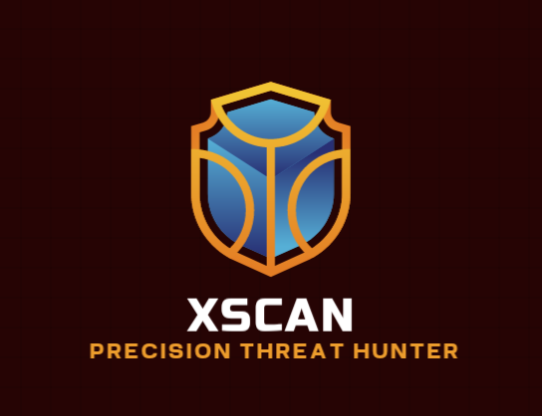

# XScan - Cross-Platform Security Scanner




XScan is a comprehensive security scanner that works across Termux, Kali Linux, and Windows platforms. It detects vulnerabilities, malware, open ports, and potential security issues.

## Features

- Cross-platform compatibility (Termux, Kali Linux, Windows)
- Malware detection
- Open port scanning
- Vulnerability assessment
- Webcam status check
- Call forwarding detection
- Detailed reporting

## Installation

### Quick Install

```bash
git clone https://github.com/TheXChlaws/xscan.git
cd xscan
./scripts/install.sh